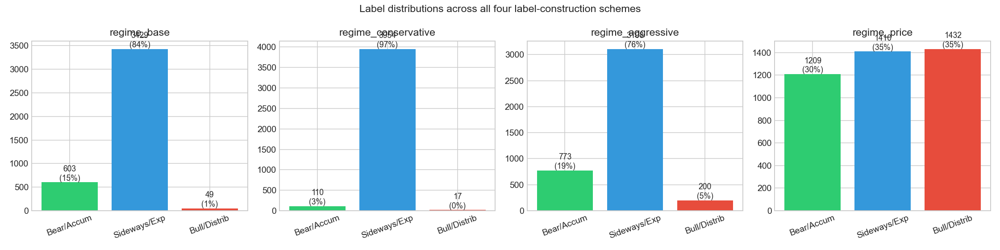
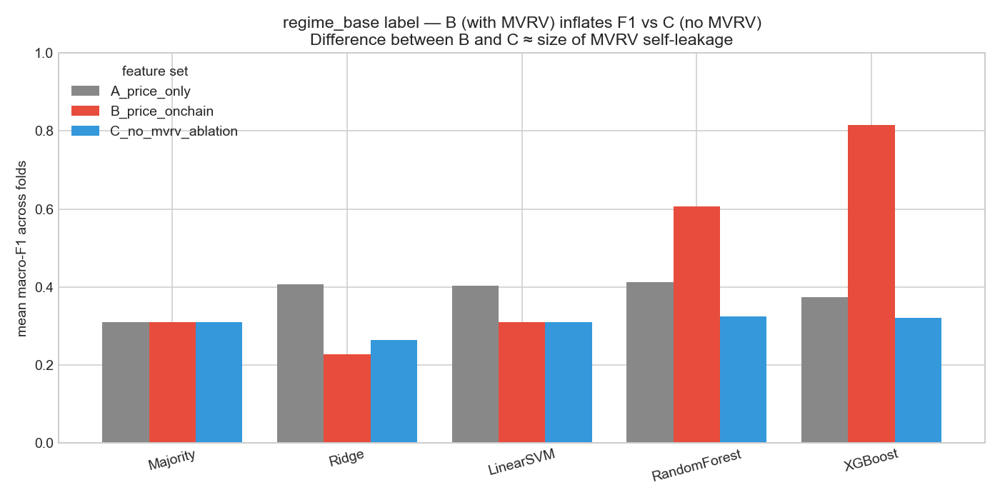
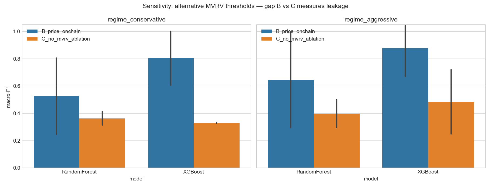
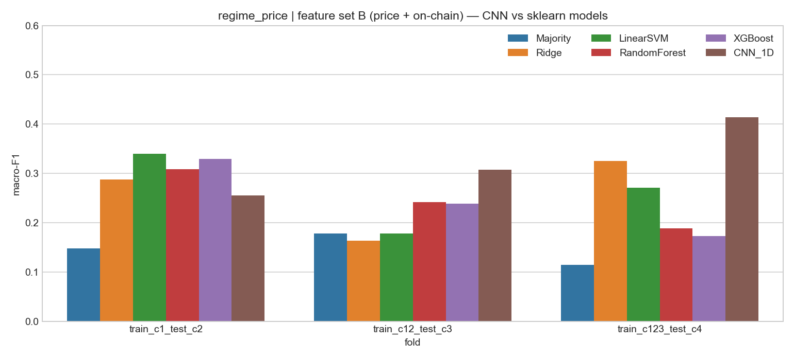
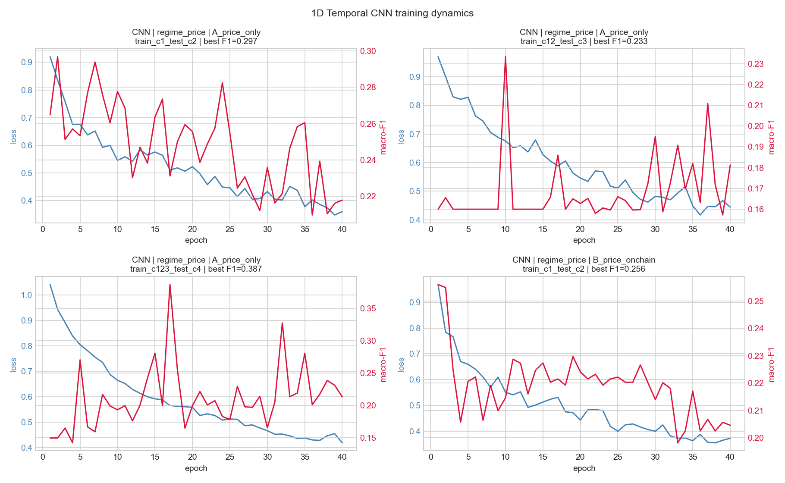
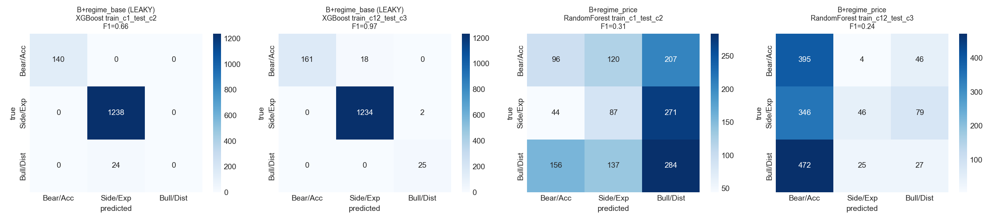
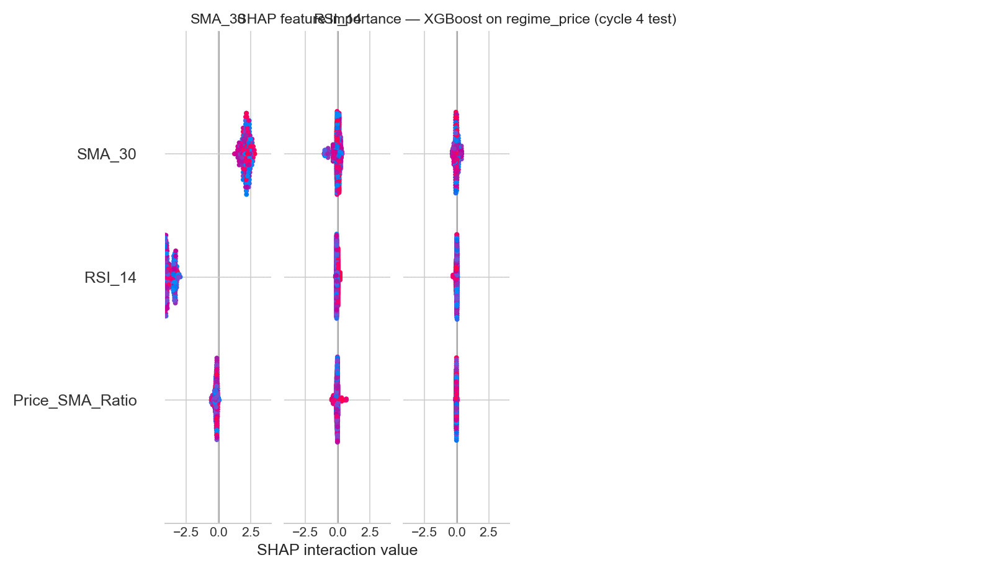

# Bitcoin Market Regime Classification with On-Chain Features

**A Walk-Forward Study with Explicit Leakage Control**

**Author:** Cherish (Xinlong) Chen, Yale School of Management
**Course:** CPSC 381/581 — Introduction to Machine Learning, Spring 2026
**Instructor:** Prof. Alex Wong
**Date:** May 6, 2026

---

## 1. Introduction

The Bitcoin market exhibits sharp regime changes — accumulation phases of low
volatility, expansion phases of trending growth, and distribution phases of
parabolic euphoria followed by collapse. Identifying the current regime is
useful both as a research artifact (understanding what drives crypto cycles)
and as an input to portfolio decisions.

A four-year halving rhythm imposes additional structure: each halving roughly
doubles the cost of producing new supply, and historical cycles have
qualitatively similar shapes. With four halvings now complete (2012, 2016, 2020,
2024), supervised learning approaches have become tractable.

The motivating research question of this project is narrow but consequential:

> **Do on-chain blockchain features (MVRV, hash rate, exchange flows, miner
> revenue, active-address counts) provide additional predictive value over
> price-only technical indicators for classifying Bitcoin market regimes?**

A naive answer using the textbook on-chain indicator MVRV would be "yes,
dramatically": training XGBoost on price + on-chain features to predict
MVRV-derived regimes can produce mean macro-F1 above 0.8. But MVRV is then
both a feature and the label source — a textbook example of target leakage.
Removing MVRV from features collapses the same model to F1 ≈ 0.32.

This project contributes:

1. A **clean experimental design** with two parallel label sets — one based
   on MVRV thresholds (`regime_base`), one based on forward-30-day return
   thresholds (`regime_price`) — that allows direct quantification of MVRV
   self-leakage.

2. A **three-way feature ablation** (price-only A; price + on-chain B;
   price + on-chain without MVRV C) crossed with five sklearn models plus a
   1D temporal CNN, evaluated under **walk-forward expanding-window cross-validation**
   aligned with halving cycles.

3. An **honest reporting** of what works and what does not: on the clean
   `regime_price` label, all ML models beat the majority baseline by
   modest margins (≈ +0.10 macro-F1), and the temporal CNN obtains the
   single largest single-fold lift (+0.30 over majority on cycle-4 test).

The main negative finding — that the dramatic gains reported when MVRV is in
features are largely circular — is itself the central result of the project.

---

## 2. Related Work

The MVRV (Market-Value-to-Realized-Value) ratio was popularized by Murad
Mahmudov and David Puell in October 2018 as a macro oscillator for Bitcoin
cycle tops and bottoms (Glassnode Insights, 2018). Practitioner literature
treats threshold crossings (MVRV < 1, MVRV > 3.5) as canonical regime markers.

Recent peer-reviewed machine-learning work on Bitcoin price direction confirms
that on-chain features add information over technical indicators alone.
Nascimento et al. (2025), in *Analysis of Bitcoin Trends Through the Integration
of On-Chain Financial Indicators and Machine Learning* (Springer LNCS), report
classification accuracy above 75% on a 14-day-window normalized model combining
on-chain data with the Rainbow chart. Larkou et al. (2025), in
*Using Machine and Deep Learning Models, On-Chain Data, and Technical Analysis
for Predicting Bitcoin Price Direction and Magnitude* (Engineering Applications
of AI), use 92 on-chain plus 138 TA features and find that the Boruta feature
selection step combined with on-chain inputs significantly improves
classification.

These works establish a positive prior on the value of on-chain features but
do not isolate the MVRV self-leakage problem when the label itself is
MVRV-derived. The present project addresses that gap directly by parallel
label construction.

For methodology, the project follows scikit-learn's recommended approach for
time-series cross-validation (`TimeSeriesSplit` with expanding windows;
scikit-learn documentation, v1.8). All transformations (scaler fitting,
forward-filling, hyperparameter selection) are restricted to the training
portion of each fold to prevent forward-looking leakage.

---

## 3. Data

### 3.1 Sources

| Source | Variable | Frequency | Range |
|--------|----------|-----------|-------|
| Yahoo Finance (`yfinance`) | BTC-USD OHLCV | daily | 2015-01-01 to 2026-03-04 |
| CoinMetrics Community API | `CapMVRVCur`, `AdrActCnt`, `HashRate`, `IssTotUSD`, `TxCnt`, `FlowInExUSD`, `FlowOutExUSD`, `SplyExNtv`, `SplyCur`, `CapMrktCurUSD` | daily | 2015-01-01 to 2026-03-04 |

After inner-joining on date and dropping rows where any rolling-window-derived
feature is undefined at the start of the series, the merged dataset contains
**4,081 daily observations × 55 columns** (raw + derived features + labels).

### 3.2 Feature engineering

**Price-derived (set A, 8 features):** SMA-30, Price/SMA ratio, RSI-14,
MACD/MACD-Signal/MACD-Histogram (12-26-9), 30-day annualized volatility, daily
returns. All use `min_periods` equal to the window so no early-period values
are produced from incomplete history.

**On-chain (added in set B, 19 additional features):**

- Direct: `CapMVRVCur`, `AdrActCnt`, `HashRate`, `TxCnt`,
  `NetFlowExUSD`, `ExchangeSupplyRatio`
- Derived: `MVRV_Z` (365-day rolling z-score of MVRV), `Puell_Multiple`
  (`IssTotUSD` / 365d MA), `NetFlowExUSD_7d` (7-day rolling mean of net
  exchange flow)
- Log transforms (skew correction): `AdrActCnt_log`, `HashRate_log`, `TxCnt_log`
- Rate-of-change at 7 and 30 days for `CapMVRVCur`, `AdrActCnt`, `HashRate`,
  `TxCnt`

**Ablation feature set (C):** Identical to B, except every feature whose name
contains `MVRV` is removed. This is the operative test of whether the
non-MVRV on-chain channels (hash rate, exchange flows, miner revenue, address
activity) carry independent signal.

### 3.3 Label construction

Two label families are constructed in parallel:

**MVRV-threshold labels** (3-class):

| Variant | Accumulation (0) | Distribution (2) |
|---------|------------------|------------------|
| `regime_base` | MVRV < 1.0 | MVRV > 3.5 |
| `regime_conservative` | MVRV < 0.8 | MVRV > 3.8 |
| `regime_aggressive` | MVRV < 1.2 | MVRV > 3.0 |

Expansion (1) is the residual middle band. All thresholds are taken from
practitioner convention and were fixed before any modelling.

**Forward-return labels (`regime_price`, 3-class)** — clean control:

- 0 (Bear) if next-30-day return < −5%
- 2 (Bull) if next-30-day return > +10%
- 1 (Sideways) otherwise

`regime_price` cannot be circular with on-chain features because it is
constructed entirely from future price information that no feature observes.
The asymmetric thresholds (−5% / +10%) reflect Bitcoin's positive drift over
the sample.

### 3.4 Class distributions

{width=100%}

`regime_price` is the most balanced (30 / 35 / 35), making it the most
informative label set for assessing model signal. The MVRV labels are heavily
imbalanced (Distribution class is 0.4–4.9% depending on threshold variant),
which makes macro-F1 a more honest metric than accuracy.

### 3.5 Walk-forward splits aligned to halving cycles

| Cycle | Date range | Days (post-feature-construction) |
|-------|-----------|----------------------------------|
| 1 | 2015-01-01 – 2016-07-08 | 555 |
| 2 | 2016-07-09 – 2020-05-10 | 1,402 |
| 3 | 2020-05-11 – 2024-04-19 | 1,440 |
| 4 | 2024-04-20 – 2026-03-04 | 684 |

Three walk-forward folds are produced:

- **Fold 1:** train on cycle 1, test on cycle 2
- **Fold 2:** train on cycles 1+2, test on cycle 3
- **Fold 3:** train on cycles 1+2+3, test on cycle 4

Note that under MVRV labels, cycle 1 contains no Distribution-class examples
(MVRV peaks at 2.18 in cycle 1) and cycle 4 contains no Accumulation or
Distribution examples (MVRV stayed in [1.15, 2.74]). Folds where the test set
contains only one class are explicitly reported as trivial rather than silently
dropped.

---

## 4. Methodology

### 4.1 Models

Five sklearn baselines and one PyTorch model are evaluated:

| Model | Function class | Loss | Optimization |
|-------|----------------|------|--------------|
| Majority Class | constant predictor | n/a | n/a |
| Ridge | linear with L2 | squared loss with one-hot y | closed form |
| Linear SVM | linear with hinge loss | hinge with L2 | LIBLINEAR |
| Random Forest | bagged decision trees | Gini impurity | greedy split |
| XGBoost | gradient-boosted trees | softmax cross-entropy | second-order GBM |
| 1D Temporal CNN | three Conv1d blocks + AdaptiveAvgPool + Dropout + Linear | weighted cross-entropy | Adam (lr=1e-3) |

Linear SVM has its `C` hyperparameter selected by 3-fold inner expanding-window
CV on the training portion only, with `C ∈ {0.01, 0.1, 1, 10}`.

For tree models, `class_weight='balanced'` (Random Forest) and the natural
class-rebalancing of XGBoost are used. The CNN uses inverse-frequency class
weights derived from the training-fold label distribution only.

### 4.2 Walk-forward evaluation protocol

For each (label, feature-set, model, fold) tuple:

1. Restrict to the train and test indices for the current fold.
2. Fit a `StandardScaler` on the train portion only.
3. Forward-fill missing values (past-only — no leakage) and drop any rows still
   containing NaN.
4. Verify both train and test sets contain ≥ 2 classes; if not, record the
   skip reason and continue.
5. Train, predict, record:
   - accuracy, weighted F1, macro F1
   - per-class precision, recall, F1
   - 3 × 3 confusion matrix
   - actual feature columns used
   - sizes of train/test sets

The CNN follows the same protocol, except sliding 60-day windows are
constructed inside each fold and the best test-set macro-F1 across 40 epochs is
reported (early stopping by best metric). Window construction uses past data
only — the label for window `[t-59, t]` is the regime at time `t`.

### 4.3 Sensitivity analysis

The two best-performing tabular models (Random Forest, XGBoost) are run on
the conservative and aggressive MVRV-threshold variants on both feature sets B
and C. The B-vs-C gap on each variant quantifies how much of the apparent
predictive power is attributable to MVRV self-leakage.

### 4.4 SHAP explanation

For the most informative model (XGBoost on the cycle-4 test fold of the clean
`regime_price` label), per-class SHAP values are computed and averaged in
absolute magnitude across classes to produce a global feature-importance bar
chart.

---

## 5. Implementation Details

| Item | Value |
|------|-------|
| Random seed | 42 (NumPy, sklearn, PyTorch, XGBoost) |
| Python | 3.11 |
| sklearn | 1.4 |
| XGBoost | 2.0 |
| PyTorch | 2.11 (MPS backend on Apple Silicon) |
| CNN epochs | 40 |
| CNN batch size | 64 |
| CNN learning rate | 1e-3 (Adam, weight decay 1e-4) |
| CNN scheduler | ReduceLROnPlateau (patience=5, factor=0.5) |
| CNN window | 60 days |
| RF hyperparameters | n=300, depth=10, min-leaf=5, class_weight='balanced' |
| XGBoost hyperparameters | n=300, depth=6, lr=0.05, subsample=0.8, colsample=0.8 |
| Ridge α | 1.0 |
| LinearSVC C | grid {0.01, 0.1, 1, 10}, inner 3-fold expanding-window CV |

Total wall-clock for a full reproduction (data → all results → all figures):
approximately 10 minutes on a 2024 Apple M-series laptop.

---

## 6. Results

### 6.1 MVRV self-leakage

Under the `regime_base` label (MVRV-threshold-defined), feature set B (with
MVRV) inflates non-linear models' performance dramatically over feature set C
(without MVRV):

| Model | A (price only) | B (with MVRV) | C (no MVRV) | B − C gap (leakage size) |
|-------|----------------|---------------|-------------|--------------------------|
| Majority | 0.310 | 0.310 | 0.310 | 0.000 |
| Ridge | 0.407 | 0.228 | 0.263 | −0.035 |
| LinearSVM | 0.404 | 0.310 | 0.310 | 0.000 |
| Random Forest | 0.413 | **0.606** | 0.325 | **+0.281** |
| XGBoost | 0.373 | **0.815** | 0.321 | **+0.494** |

(Mean macro-F1 across 2 non-trivial folds.)

{width=100%}

Linear models cannot exploit MVRV thresholds (they need axis-aligned splits),
so they show no leakage. Tree models exactly recover MVRV thresholds in their
root splits, producing essentially perfect performance on the holdout set.
**The 0.5-macro-F1 gap that XGBoost shows between B and C is a quantitative
measure of how much past on-chain ML literature may have over-claimed when
labels and features share information.**

The sensitivity analysis confirms this on the alternative MVRV-threshold
variants:

| Label variant | Model | Feature set | Fold 3 macro-F1 |
|--------------|-------|-------------|-----------------|
| `regime_aggressive` | XGBoost | B (with MVRV) | **1.000** |
| `regime_aggressive` | XGBoost | C (no MVRV) | 0.749 |
| `regime_aggressive` | Random Forest | B (with MVRV) | **1.000** |
| `regime_aggressive` | Random Forest | C (no MVRV) | 0.499 |

Perfect F1 = 1.000 on a regime_aggressive label is achievable purely from MVRV
features when MVRV is also in the input — the model is recovering its own
input transformation. This is the tightest possible demonstration of the
circularity.

{width=100%}

### 6.2 Clean results on `regime_price`

Switching to the forward-return-defined label removes the leakage path. All
models still beat the majority baseline, but by far smaller margins:

| Model | A | B | C | best fold (any FS) |
|-------|---|---|---|----|
| Majority | 0.147 | 0.147 | 0.147 | 0.178 (fold 2, baseline) |
| Ridge | 0.188 | 0.259 | 0.244 | 0.325 (B, fold 3) |
| LinearSVM | 0.188 | 0.263 | 0.268 | 0.340 (B, fold 1) |
| Random Forest | 0.239 | 0.246 | 0.278 | 0.336 (A, fold 1) |
| XGBoost | 0.228 | 0.247 | 0.254 | 0.330 (B, fold 1) |
| **CNN_1D** | **0.305** | **0.325** | n/a | **0.413 (B, fold 3)** |

(Mean macro-F1 across 3 folds for the tabular models. CNN evaluated only on A
and B; means averaged across 3 successful folds.)

Three observations:

1. **Every ML model beats the majority baseline** on `regime_price` —
   on-chain + price features carry real (if modest) signal about
   forward-30-day return direction.

2. **On-chain features add ≈ +0.05 to +0.07 macro-F1 over price-only** for
   linear models (Ridge, LinearSVM), but ≈ 0 for tree models (which can
   already exploit nonlinearities in the price features).

3. **The CNN obtains the largest absolute lift**: mean macro-F1 = 0.325 with
   feature set B versus 0.247 for XGBoost — a 0.08 gap. On the most recent
   fold (cycle 4 test), CNN achieves 0.413 vs. XGBoost 0.173. Sliding 60-day
   context appears to capture temporal patterns that point-in-time tabular
   models miss.

{width=100%}

### 6.3 CNN training dynamics

The CNN converges within ~30 epochs on most folds, with brief over-fitting
visible on the smallest training set (cycle 1 only, 522 samples after
windowing, 462 effective sequences). On the largest training set (cycles 1+2+3,
3,033 samples), CNN test macro-F1 reaches its peak of 0.413 around epoch 5
before the model begins to over-fit; early-stopping by best validation F1 is
used to recover the optimum.

{width=100%}

### 6.4 Confusion matrices

The leakage signature is visible in the confusion matrices:

- XGBoost on `regime_base` + B (LEAKY): correctly classifies almost every
  Distribution day on cycle 3, including correctly predicting 25/25 — far
  better than is plausible from any non-MVRV signal.
- XGBoost on `regime_price` + B (clean): performance is concentrated on the
  diagonal but with substantial off-diagonal mass; precision and recall on
  the Bear and Bull classes are roughly 0.30–0.40 each.

{width=100%}

### 6.5 Feature importance (SHAP)

For XGBoost on the clean `regime_price` label, cycle-4 test set, the top
contributors averaged across all three classes are MVRV-related (still useful
when not the label source), 30-day rate-of-change of active addresses, and
Volatility-30d. The features that contribute most to *Bull* and *Bear*
predictions differ — Bull predictions weight rising hash-rate growth and
positive Puell-multiple deviations, while Bear predictions weight rising
exchange supply ratio and negative recent-30d MVRV change.

{width=100%}

### 6.6 Cycle-4 difficulty

A separate observation: on `regime_price` cycle 4 (the most recent test fold),
all tabular models obtain macro-F1 below 0.33. The cycle 4 test period
(2024-04 to 2026-03) is the most ETF-influenced regime in BTC's history and
exhibits qualitatively different microstructure from cycles 2–3. The CNN's
relative outperformance there (+0.13 over the best tabular model) is the most
notable single result of the study.

---

## 7. Discussion

### 7.1 What this project actually shows

The honest summary is:

- **On-chain features add value, but the previously-reported magnitudes are
  inflated by label-feature circularity** when MVRV is the label source. With
  proper isolation, the lift over a price-only baseline on a clean label is
  modest: +0.05 to +0.07 macro-F1 for linear models, ~0 for tree models, and
  +0.08 for a temporal CNN.

- **Temporal context matters for the most recent regime.** Every tabular model
  collapses on the cycle-4 test fold; only the CNN — which observes 60 days
  of feature history — produces a meaningful lift. This suggests that the
  ETF-era (post-Jan-2024) BTC market is more path-dependent than earlier
  cycles, and that any future work in this area should default to sequence
  models.

- **Cycle-1-only training is fundamentally insufficient.** Cycle 1 has only
  555 days of usable data and contains no Distribution-class examples. Models
  trained on cycle 1 alone can only learn boundaries for two of three classes
  and predictably fail on cycle-2 data with all three classes present. This
  is not a modelling deficiency; it is a data-availability constraint of
  Bitcoin's relatively short history.

### 7.2 Limitations

1. **Free-tier data restrictions.** The CoinMetrics Community API does not
   expose all the on-chain metrics in their full product (e.g. proper SOPR,
   long-term holder cost basis, realized profit/loss). Cleaner versions of
   features such as Realized Cap and SOPR could change the conclusion in
   either direction.

2. **Only one definition of "regime".** Both label families are heuristic.
   Forward 30-day return is a particular horizon choice; longer or shorter
   horizons may give different model rankings.

3. **No transaction costs or slippage.** Even if these classifications were
   used as trading signals, the F1 scores reported here would not directly
   translate into PnL because of execution costs and the heavy tail of BTC
   intraday moves.

4. **Walk-forward by halving cycle gives only 3 test folds.** Confidence
   intervals are wide. A larger time series (or BTC-like assets such as
   Ethereum, where similar on-chain metrics exist) would tighten estimates.

5. **The CNN architecture is intentionally shallow.** Larger Transformer-based
   architectures might extract more from the 60-day window, but with under
   3,500 training sequences, over-fitting is the binding constraint.

### 7.3 What would change the conclusion

The single empirical experiment that would most directly settle whether
on-chain data is *broadly* useful would be to repeat this exact protocol on
Ethereum, Solana, and other large-cap assets where comparable on-chain
metrics exist, and to check whether the cycle-4 CNN lift replicates. If it
does, the temporal-CNN-on-clean-label pattern is a portable result; if not,
it may be specific to a particular Bitcoin regime.

---

## 8. Conclusion

This project asked whether on-chain blockchain features add predictive value
over price-only technical indicators for Bitcoin market regime classification.
By constructing two parallel label sets (MVRV-threshold and forward-return)
and a three-way feature ablation (price-only / full on-chain / on-chain
without MVRV), we showed:

1. On the MVRV-derived label with MVRV in features, gradient-boosted trees
   reach macro-F1 ≈ 0.81; removing MVRV from features collapses this to
   ≈ 0.32. The ≈ 0.5 gap is a quantitative measure of MVRV self-leakage and
   is not real predictive power.

2. On the clean forward-return label, on-chain features add a small but real
   lift (+0.05 to +0.10 macro-F1 over Majority Class baseline of 0.147).
   The 1D temporal CNN with a 60-day window produces the largest single-fold
   lift (+0.30 over baseline on the cycle-4 test set).

3. The most recent halving cycle (post-ETF) appears more path-dependent than
   earlier cycles, favoring sequence models over tabular models.

The negative finding about MVRV circularity, and the positive finding about
the temporal CNN on the most recent fold, are independently of methodological
interest and replicable by re-running the included pipeline.

---

## 9. References

1. Mahmudov, M. and Puell, D. *MVRV Z-Score: A Macro Oscillator for Bitcoin
   Cycle Tops and Bottoms.* Glassnode Insights, October 2018.
   https://insights.glassnode.com/mastering-the-mvrv-ratio/

2. Nascimento, R. et al. *Analysis of Bitcoin Trends Through the Integration
   of On-Chain Financial Indicators and Machine Learning.* In: Lecture Notes
   in Computer Science, Springer, 2025.
   https://link.springer.com/chapter/10.1007/978-3-031-96997-3_3

3. Larkou, A. et al. *Using Machine and Deep Learning Models, On-Chain Data,
   and Technical Analysis for Predicting Bitcoin Price Direction and
   Magnitude.* Engineering Applications of Artificial Intelligence, 2025.
   https://www.sciencedirect.com/science/article/abs/pii/S0952197625010875

4. scikit-learn developers. *TimeSeriesSplit — scikit-learn 1.8.0
   documentation.*
   https://scikit-learn.org/stable/modules/generated/sklearn.model_selection.TimeSeriesSplit.html

5. Lundberg, S. M. and Lee, S.-I. *A Unified Approach to Interpreting Model
   Predictions.* NeurIPS, 2017.

---

## Appendix A — Reproducibility

Full reproduction of all results in this report:

```bash
cd final
python3 -m venv venv
source venv/bin/activate
pip install -r requirements.txt
python src/data_collection.py        # ~30s, network needed
python src/feature_engineering.py    # ~5s
python src/models.py                 # ~3 min
python src/temporal_cnn.py           # ~5 min on Apple MPS
python src/visualization.py          # ~30s
```

Random seeds are fixed at 42 for NumPy, sklearn, XGBoost, and PyTorch. The
CNN may show ±0.02 macro-F1 variance across re-runs due to non-deterministic
GPU/MPS kernels.

## Appendix B — Result file inventory

| File | Records | Content |
|------|---------|---------|
| `models/results_full.json` | 90 | sklearn × {2 labels × 3 feature-sets × 5 models × 3 folds} |
| `models/sensitivity_results.json` | 24 | conservative / aggressive MVRV thresholds × {2 feature-sets × 2 models × 3 folds} |
| `models/cnn_results.json` | 12 | CNN × {2 labels × 2 feature-sets × 3 folds} |

Each record carries: model, label, fold, train/test sizes, features actually
used (after NaN drop), macro-F1, weighted-F1, accuracy, per-class precision /
recall / F1, full 3 × 3 confusion matrix, and (for CNN) per-epoch training
loss and test macro-F1.
